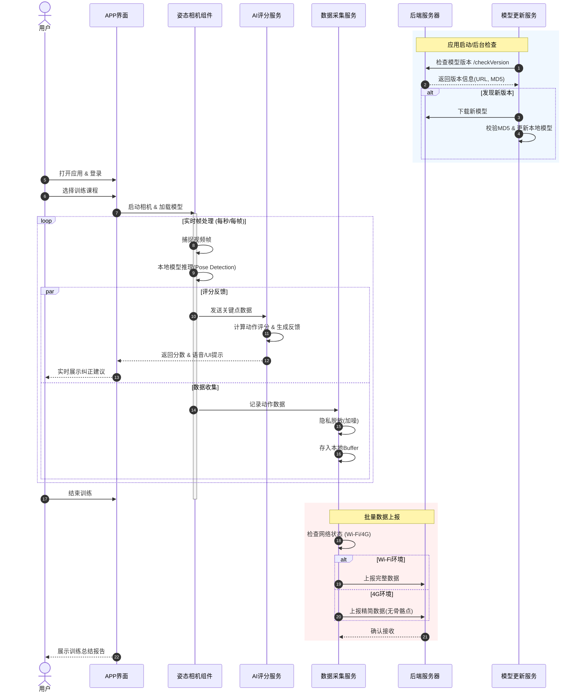

# 项目流程图文档

本文档包含了项目的依赖关系图和核心业务流程图。

## 1. 模块依赖关系图 (Dependency Graph)

此图展示了各个核心模块、服务与组件之间的调用与依赖关系。

```mermaid
graph TD
    %% 定义样式
    classDef app fill:#f9f,stroke:#333,stroke-width:2px;
    classDef component fill:#dfd,stroke:#333,stroke-width:2px;
    classDef service fill:#bbf,stroke:#333,stroke-width:2px;
    classDef infrastructure fill:#fbb,stroke:#333,stroke-width:2px;

    subgraph UI_Layer [表现层 (UI/App)]
        direction TB
        AppEntry["应用入口 (App.tsx)"]:::app --> AuthScreen["认证页面"]:::app
        AppEntry --> MainTabs["主导航"]:::app
        MainTabs --> WorkoutScreen["训练页面"]:::app
    end

    subgraph Component_Layer [组件层 (Components)]
        WorkoutScreen --> PoseCamera["姿态检测相机<br/>(PoseDetectorCamera)"]:::component
    end

    subgraph Service_Layer [服务层 (Services)]
        PoseCamera --> AIScoring["AI评分服务<br/>(AIScoringService)"]:::service
        PoseCamera --> DataCollector["数据采集服务<br/>(DataCollector)"]:::service
        
        AIScoring -.-> Logic{"评分逻辑"}
        
        DataCollector --> Privacy["隐私脱敏处理"]:::service
        Privacy --> Buffer["本地缓冲"]:::service
        
        ModelUpdater["模型更新服务<br/>(ModelUpdater)"]:::service
    end

    subgraph Infra_Layer [基础设施与后端 (Infra & Backend)]
        AuthService["认证服务"]:::service --> APIClient["API客户端"]:::infrastructure
        AIScoring --> APIClient
        Buffer --> APIClient
        ModelUpdater --> APIClient
        ModelUpdater --> FileSystem["本地文件系统"]:::infrastructure
        
        APIClient --> BackendServer(("后端服务器")):::infrastructure
    end

    %% 关系连线
    AuthScreen --> AuthService
```

## 2. 核心业务流程图 (Business Process Flow)

此图描述了用户从登录到完成一次AI辅助训练的完整业务流程。


